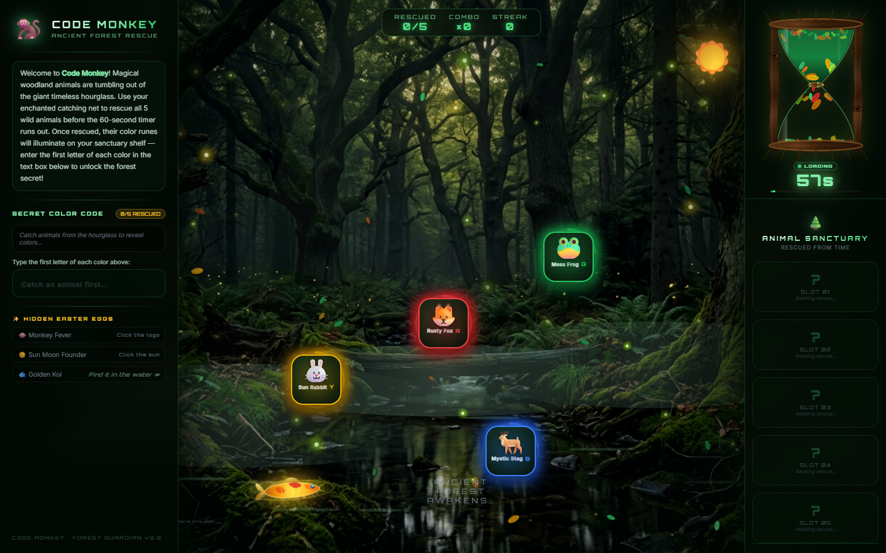
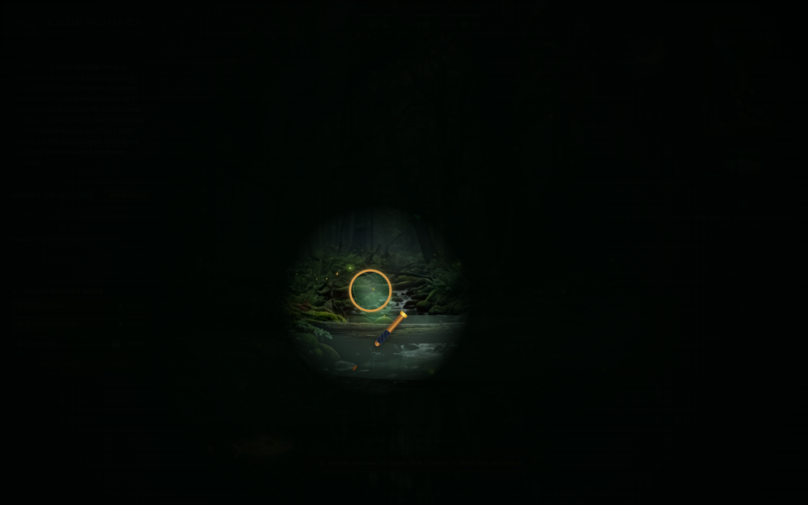
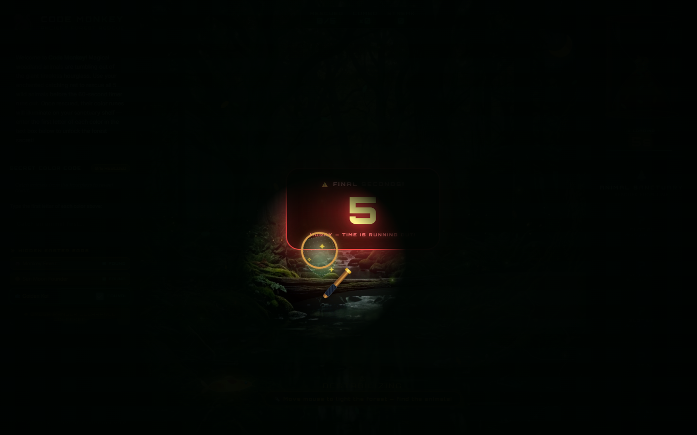
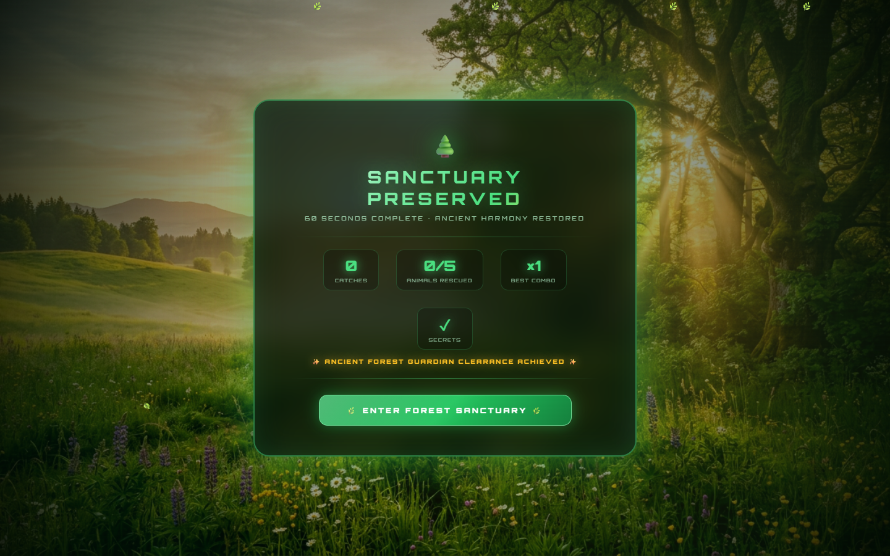
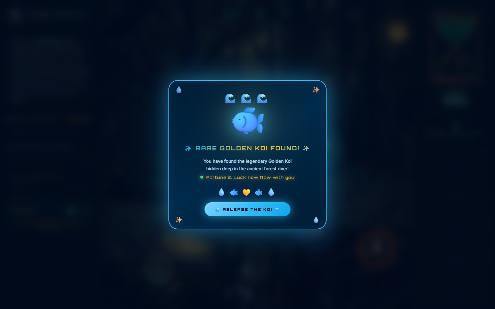
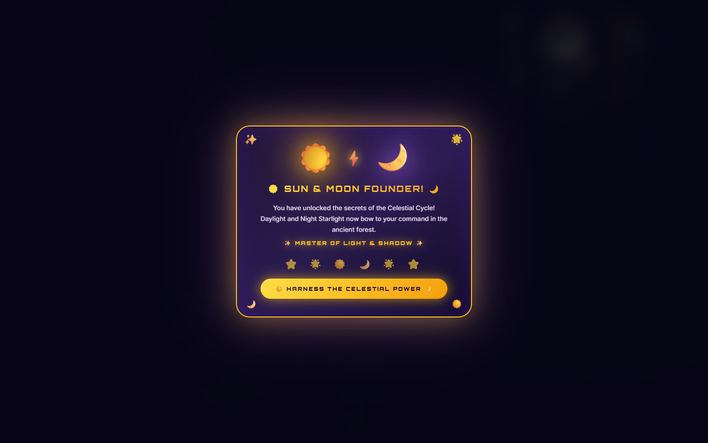
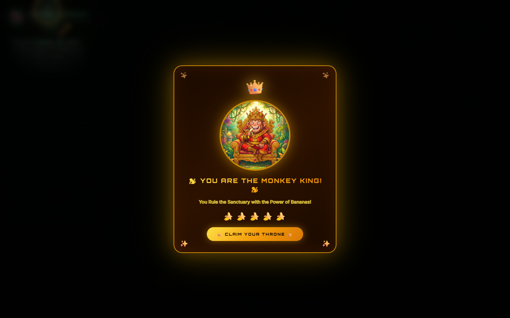

# 🐒 CODE MONKEY — ANCIENT FOREST RESCUE
### ⏳ Interactive 60-Second Loading Experience

An enchanted, interactive loading screen and mini-game built with **React** and **Vite** for the **VIT Chennai Hackathon (Problem Statement 1: Fun with Webpage)**.

---

## 🌟 Overview

**Code Monkey: Ancient Forest Rescue** transforms traditional passive waiting into an engaging, gamified adventure. Over a 60-second timer, woodland animals tumble out of a giant carved timeless hourglass into an enchanted ancient forest. Players use an enchanted catching net to rescue animals, unlock color runes, decode the sanctuary secret, and discover mystical Easter eggs.

---

## 📸 Visual Showcase & Screenshots

### 1. Main Interactive Gameplay Arena

*The central forest arena featuring the carved Hourglass clock, swimming Golden Koi in the river, HUD trackers, and the interactive enchanted catching net.*

---

### 2. Secret Color Code Auto-Fill & Animal Rescue

*Clicking an animal rescues it to the Sanctuary Shelf on the right, illuminates its color rune, and automatically appends its letter code into the Left Panel.*

---

### 3. Final 5-Second Dramatic Countdown

*When the timer reaches the final 5 seconds, a massive pulsating countdown with warning lights appears directly on the main arena.*

---

### 4. Final Screen: Sanctuary Preserved (Photorealistic Grassland Theme)

*The 60-second completion screen featuring an 8K photorealistic sunlit grassland meadow background, emerald sanctuary frosted glass card, performance statistics, and secret clearance badge.*

---

## ✨ Hidden Easter Eggs

The game includes **3 secret Easter eggs**, fully tracked in real-time in the Left Panel:

### 🐟 1. Golden Koi Easter Egg


- **How to Find**: Look into the river at the bottom of the center screen. A golden koi swims back and forth with animated ripples and fin movement.
- **Action**: Move your catching net over the river and click directly on the Golden Koi.
- **Reward**:
  - The fish leaps high into the air with animated water splash particles.
  - Floating notification: `✨ 🐟 GOLDEN KOI CAUGHT! ✨`.
  - Opens the **Rare Golden Koi Popup** (`🍀 Fortune & Luck now flow with you!`).
  - Left Panel status immediately updates to `✅ FOUND!`.

---

### ☀️ 2. Sun & Moon Founder Easter Egg


- **How to Find**: Spot the radiant glowing **☀️ Sun** icon located in the upper-right corner of the center game arena.
- **Action**: Click the Sun icon to harness celestial powers.
- **Reward**:
  - Launches the celestial **Sun & Moon Founder Popup** (`✨ MASTER OF LIGHT & SHADOW ✨`).
  - Shifts the forest into **Night Mode** with an interactive mouse flashlight/torch beam.
  - Clicking the **🌙 Moon** restores daytime sunlight.
  - Left Panel status unlocks with `✅ FOUND`.

---

### 🐵 3. Monkey King Easter Egg


- **How to Find**: The **CODE MONKEY** brand header at the top of the Left Panel.
- **Action**: Click the Monkey emoji or brand banner.
- **Reward**:
  - Celebratory royal crown animation.
  - Opens the **Monkey King Popup** (`👑 YOU ARE THE MONKEY KING! 👑`).
  - Unlocks `🐵 Monkey Fever` in the tracker with `✅ FOUND`.

---

## 🎮 Core Game Mechanics & Features

### 🐾 1. Animal Rescuing & Rune Illumination
Five ancient animals pop into the forest clearing at random spots:
| Animal | Rune Color | Letter Code | Emoji |
|---|---|:---:|:---:|
| **Rusty Fox** | Crimson Red | **R** | 🦊 |
| **Elder Owl** | Vibrant Orange | **O** | 🦉 |
| **Sun Rabbit** | Golden Yellow | **Y** | 🐰 |
| **Moss Frog** | Emerald Green | **G** | 🐸 |
| **Mystic Stag** | Sapphire Blue | **B** | 🦌 |

- **Catching**: Swing the net over animals before they vanish.
- **Combos & Streaks**: Consecutive catches build up combo multipliers (`🔥 COMBO ×3!`).

---

### ✍️ 2. Secret Color Code Auto-Fill
- As each animal is rescued, its initial letter is **automatically filled** into the Secret Color Code input on the Left Panel.
- Interactive token indicators display real-time green match feedback.
- Rescuing 3 or more animals reveals the **FOREST CODE CRACKED!** banner.

---

### ⏳ 3. Giant Ancient Hourglass with "LOADING" Label
- Hand-crafted HTML5 Canvas simulation of an ancient hourglass carved from oak bark with winding roots and vine waist ring.
- Real leaf particle physics flowing through the pinched glass neck.
- Prominently displays a pulsing green `LOADING` indicator and exact seconds remaining below the hourglass clock.

---

### 📜 4. Scrollable Animal Sanctuary Shelf
- The **Right Column** (`.right-column`) is exclusively scrollable with a custom emerald scrollbar.
- Allows seamless scrolling through all 5 animal sanctuary slots, slot indices, and progress counters on screens of any height without affecting the rest of the game view.

---

### ⚠️ 5. Main Display 5-Second Countdown
- When `remaining <= 5s`, an urgent center overlay pulses onto the main screen:
  - Big countdown digits (`5`, `4`, `3`, `2`, `1`).
  - Urgent alert header: `⚠️ FINAL SECONDS!`.
  - Amber/red aura burst indicating urgency before time expires.

---

### 🌿 6. Photorealistic Grassland Completion Screen
- When the 60-second journey completes, the screen gracefully transitions to the **Sanctuary Preserved** summary page.
- Set against a high-resolution photorealistic grassland meadow with golden sunlight and morning mist.
- 100% static, crisp, and stable (free of background vibrations or shaking).
- Displays total catches, animals rescued, highest combo streak, and secrets unlocked, plus a restart button to replay the experience.

---

## 🛠️ Tech Stack

- **Framework**: React 18
- **Build Tool**: Vite 5 (with `vite-plugin-singlefile` support)
- **Styling**: Vanilla CSS3 (Glassmorphism, CSS Grid/Flexbox, Keyframe animations)
- **Canvas Rendering**: HTML5 2D Canvas API for particle dynamics & god rays
- **Automation / Testing**: Puppeteer Core for screenshot generation

---

## 🚀 Getting Started

### Prerequisites
- Node.js (v18 or higher recommended)
- npm or yarn

### Installation
```bash
# Clone the repository
git clone https://github.com/yuvarajhariprabu/vit-chennai-hacakathon-problem-statement-1.git

# Navigate into the project directory
cd vit-chennai-hacakathon-problem-statement-1

# Install dependencies
npm install

# Start development server
npm run dev
```

Visit `http://localhost:5173` in your browser.

### Production Build
```bash
npm run build
```
Creates a self-contained production bundle in the `dist/` directory.

---

## 👥 Authors
Developed for **VIT Chennai Hackathon** — Problem Statement 1 (*Fun with Webpage*).
